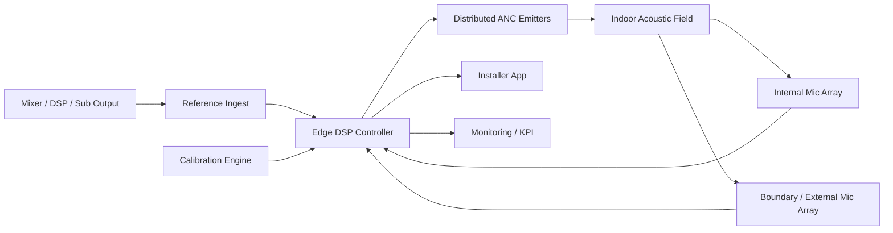

# Documentazione del sistema ANC indoor per bass spill control

Questa cartella descrive il progetto secondo una sola verita operativa: il target non e un ANC generico, ma un **sistema commerciale indoor MIMO** per la **riduzione della dispersione sonora in bassa frequenza** verso vicini e confini sensibili.

## In breve

| Tema | Decisione canonica |
|---|---|
| Focus di prodotto | `bass spill control` indoor per venue musicali |
| Architettura | `feed-forward` da mixer/DSP + sensori interni/di confine + `Edge DSP Controller` |
| Banda iniziale | `25-160 Hz`, priorita su `31.5-125 Hz` |
| KPI chiave | riduzione misurabile al confine esterno con impatto interno controllato |
| Non-obiettivo | nessuna promessa di "silenzio totale" o copertura universale |

## Architettura di riferimento

## Mappa della documentazione

| Area | Scopo |
|---|---|
| `plan.md` | decisioni prodotto, KPI, roadmap tecnica e commerciale |
| `research/` | fisica, modellazione, controllo e metodologia sperimentale |
| `code/` | stato attuale del repository MATLAB e gap verso il prodotto |
| `RAW/` | archivio sintetizzato di note legacy non autoritative |

## Percorsi di lettura

| Se vuoi capire... | Parti da... |
|---|---|
| visione prodotto e roadmap | `plan.md` |
| basi fisiche e criteri di validazione | `research/README.md` |
| come il codice attuale si colloca nella roadmap | `code/README.md` |
| cosa resta utile del materiale precedente | `RAW/` |

## Convenzioni

| Simbolo | Significato |
|---|---|
| `x(n)` | riferimento `feed-forward` acquisito da mixer/DSP |
| `d(n)` | campo primario o contributo indesiderato osservato dai sensori |
| `y(n)` | uscita digitale del controllore verso gli emitter ANC |
| `e(n)` | errore residuo sui sensori interni o di confine |
| `S(z)` | secondary path fisico tra attuatori e sensori |
| `\hat{S}(z)` | stima del secondary path usata dal controllore |

## Regole editoriali

- Il lessico corretto e `spill control`, non `cancellazione totale`.
- Il beachhead e `indoor permanente`; outdoor e fase successiva.
- Il codice MATLAB attuale va letto come **baseline di simulazione** e non come prodotto finito.
- I file in `RAW/` esistono come archivio: non sono la fonte primaria delle decisioni.
