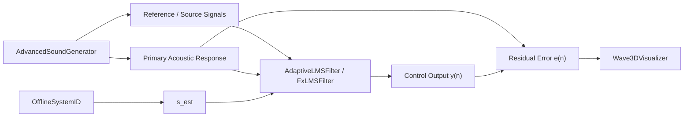

# Riferimento tecnico del codice

Questa sezione descrive il repository MATLAB per quello che e davvero oggi: una **baseline di simulazione e validazione** utile a preparare il prodotto, non ancora il prodotto commerciale indoor MIMO descritto in `plan.md`.

## Due architetture da tenere distinte

| Livello | Significato |
|---|---|
| repository attuale | testbench MATLAB principalmente `SISO` |
| architettura target | sistema `MIMO` con `reference ingest`, `Edge DSP Controller`, array di sensori e nodi ANC distribuiti |

## Architettura attuale del repository

## Come questo si mappa sul prodotto target

Nel prodotto reale:

- il riferimento non viene sintetizzato internamente, ma acquisito da `mixer/DSP`;
- `FxLMSFilter.m` diventa solo il baseline concettuale del futuro core `MIMO`;
- `OfflineSystemID.m` deve evolvere in commissioning multi-canale;
- `Wave3DVisualizer.m` deve evolvere in dashboard KPI per boundary e listening points;
- i `.mlx` devono evolvere in benchmark venue-oriented.

## Inventario rapido

| File | Ruolo attuale | Valore strategico |
|---|---|---|
| `AdaptiveLMSFilter.m` | baseline `LMS/NLMS` didattica | confronto minimo, non controller prodotto |
| `FxLMSFilter.m` | baseline `SISO` Leaky-NLMS | base per la roadmap `MIMO FxLMS` |
| `OfflineSystemID.m` | identificazione offline `SISO` | embrione della futura calibrazione venue |
| `AdvancedSoundGenerator.m` | generatori e propagazione semplificata | base del digital twin da spostare verso modelli venue |
| `Wave3DVisualizer.m` | visualizzazione offline | base per reportistica tecnica e KPI |
| `main*.mlx` | testbench di laboratorio | scenari da sostituire con benchmark indoor ufficiali |

## Gap rispetto alla roadmap

I moduli principali ancora mancanti sono quelli gia fissati nel piano:

- `MimoFxLMSController.m`
- `VenueRoomModel.m`
- `BoundaryLeakageModel.m`
- `OnlinePlantTracker.m`
- `CalibrationSession.m`
- `PerformanceMonitor.m`
- `InstallerTuningWizard.m`

## Ordine di lettura consigliato

1. `FxLMSFilter.md`
2. `OfflineSystemID.md`
3. `AdvancedSoundGenerator.md`
4. `live-scripts.md`
5. `support-files.md`

## Regola di lettura

Quando un file del repository usa ancora narrativa da "ANC generico", la documentazione canonica da seguire e questa: il contesto corretto e **indoor bass spill control con riferimento da mixer/DSP ed esecuzione futura su Edge DSP Controller**.
