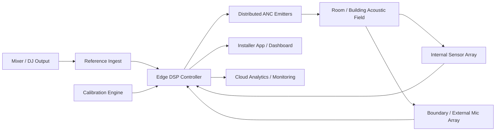

# Piano canonico di prodotto, ingegneria e commercializzazione

Questo documento e la **source of truth** del progetto. Tutta la documentazione in `docs/` deve essere interpretata alla luce di questo piano.

## Stato del piano

| Campo | Valore |
|---|---|
| focus | sistema commerciale indoor `MIMO` per `bass spill control` |
| architettura | `reference ingest` da mixer/DSP + `Edge DSP Controller` |
| beachhead | venue musicali indoor permanenti |
| criterio di verita | KPI misurati, non narrativa |

## Documento esteso

Piano di prodotto, ingegneria e commercializzazione del sistema ANC attivo per contenimento musicale.

## 1. Executive summary

Questo progetto non deve più essere trattato come un semplice prototipo ANC generico. La direzione corretta è la costruzione di un **sistema commerciale di ANC attivo multi-dispositivo** per la **riduzione della dispersione sonora da musica** in:

- locali al chiuso;
- club e sale eventi;
- venue con problemi di vicinato e limiti normativi;
- eventi outdoor come fase successiva, non come beachhead iniziale.

La tesi di prodotto è precisa:

- il sistema **non** promette “silenzio totale” all’esterno;
- il sistema promette **riduzione controllata della fuga sonora**, soprattutto in **bassa frequenza**;
- il sistema deve mantenere una buona esperienza sonora **dentro** il locale e ridurre il disturbo **fuori**.

Il primo mercato da attaccare è **indoor permanente**, perché è il caso più controllabile, misurabile e vendibile. L’outdoor resta una linea futura di espansione.

## 2. Posizionamento tecnico e commerciale

## 2.1 Definizione del prodotto

Il prodotto è un **sistema distribuito di ANC attivo per sound spill control**, composto da:

- più emettitori acustici controllati;
- più microfoni di sensing interni ed esterni;
- un controller edge DSP multi-canale;
- una procedura di calibrazione e tuning installativo;
- una piattaforma software per monitoraggio, aggiornamento e reportistica.

## 2.2 Claim commerciale corretto

Il claim corretto da usare sul mercato non è:

- “annulliamo ogni rumore fuori dal locale”.

Il claim corretto è:

- “riduciamo la dispersione sonora, soprattutto sulle basse frequenze più critiche per i vicini, preservando la qualità d’ascolto interna”.

## 2.3 Mercato iniziale

### Beachhead market

- club indoor;
- locali con DJ set;
- lounge e sale eventi;
- hotel con sale musica;
- spazi hospitality con musica amplificata e vicinato sensibile.

### Mercato secondario

- eventi outdoor con controllo perimetrale;
- installazioni temporanee;
- festival con controllo spill su confini sensibili.

## 2.4 Non-obiettivi

Il progetto non deve presentarsi, nella fase iniziale, come:

- sostituto totale dell’isolamento passivo;
- soluzione universale per tutte le frequenze;
- sistema plug-and-play senza calibrazione;
- soluzione primaria per rumore meccanico industriale impulsivo.

## 3. Problema cliente

Il cliente non compra un algoritmo. Compra la possibilità di:

- tenere la musica a livello commerciale utile più a lungo;
- ridurre reclami da vicinato;
- ridurre rischio di sanzioni o limitazioni orarie;
- aumentare la prevedibilità operativa della venue;
- mostrare dati oggettivi di controllo e conformità.

## 3.1 Buyer e stakeholder

### Buyer economico

- proprietario locale;
- gestore venue;
- gruppo hospitality;
- organizzatore eventi.

### Influencer tecnico

- system integrator AV;
- consulente acustico;
- progettista impianti;
- service audio professionale.

### Stakeholder operativo

- fonico;
- facility manager;
- tecnico di installazione;
- responsabile compliance o sicurezza.

## 4. Tesi fisica del prodotto

Per essere credibile sul mercato, il sistema deve nascere da una tesi fisica realistica:

1. la parte più disturbante per i vicini è spesso la **bassa frequenza**;
2. la bassa frequenza è anche la parte più adatta a un controllo attivo;
3. il problema reale non è “cancellare tutto”, ma **controllare il sound spill** in zone e bande specifiche;
4. il caso indoor è adatto perché esiste una geometria più stabile, una sorgente nota e una calibrazione ripetibile;
5. il sistema deve essere **MIMO**: un canale solo non è un prodotto serio per venue reali.

## 4.1 Banda obiettivo iniziale

Per la prima generazione il focus deve essere:

- `25–160 Hz` per applicazioni indoor;
- massima priorità su bande terze d’ottava `31.5 Hz`, `40 Hz`, `50 Hz`, `63 Hz`, `80 Hz`, `100 Hz`, `125 Hz`.

Per l’outdoor la prima espansione deve essere più prudente:

- `30–100 Hz`, con attenzione prioritaria a sub e low-end.

## 4.2 Regola di verità commerciale

Se il sistema non ottiene riduzione misurabile e ripetibile della dispersione in banda bassa, il prodotto non è vendibile. La narrativa non sostituisce le misure.

## 5. Architettura tecnica del prodotto

## 5.1 Architettura di alto livello

## 5.2 Blocchi prodotto

### A. Reference ingest

Acquisisce il riferimento direttamente da mixer, DSP o uscita sub. Questo è essenziale perché:

- anticipa il contenuto musicale;
- riduce il peso della causalità rispetto a un sistema solo microfonico;
- consente feed-forward reale.

### B. ANC emitter nodes

Nodi attivi installati in punti strategici:

- pareti critiche;
- prossimità a superfici radianti;
- aperture e confini interni;
- zone modalmente rilevanti.

Ogni nodo include:

- trasduttore/i;
- amplificazione;
- DSP locale o endpoint controllato;
- sincronizzazione con il controller.

### C. Sensor array

Serve una rete di sensori:

- microfoni interni per osservare il campo modale;
- microfoni esterni o di confine per misurare la fuga sonora;
- opzionalmente accelerometri su superfici radianti in fasi successive.

### D. Edge DSP controller

È il cervello del sistema. Deve gestire:

- sincronizzazione dei canali;
- routing reference/sensor;
- identificazione acustica;
- controllo adattativo multi-canale;
- supervisione di stabilità;
- logging KPI;
- profili di venue e preset operativi.

### E. Installer software

L’installazione deve essere guidata da software con:

- wizard di commissioning;
- test di impulso/sweep;
- mappa dei sensori;
- tuning assistito;
- verifica KPI prima/dopo.

### F. Cloud e monitoraggio

Non è il cuore fisico, ma è fondamentale commercialmente:

- aggiornamenti software;
- telemetria;
- storico performance;
- alert di degrado;
- report per cliente e assistenza.

## 5.3 Strategia di controllo

Il sistema non deve basarsi solo sul `FxLMSFilter.m` attuale. Quello è una base utile, ma non un’architettura prodotto completa. La strategia target deve essere:

### Layer 1 — Modellazione iniziale

- identificazione del campo acustico della venue;
- stima dei secondary path multi-canale;
- mappa dei leakage path dominanti.

### Layer 2 — Controllo modale indoor

- riduzione dell’energia dei modi interni che eccitano la dispersione;
- priorità ai modi dominanti in banda bassa.

### Layer 3 — MIMO adaptive control

- controllo `Filtered-x` multi-canale;
- combinazione feed-forward + feedback;
- compensazione online di drift e variazioni moderate.

### Layer 4 — Supervisione robusta

- limiti di guadagno;
- controllo saturazione;
- watchdog di stabilità;
- fallback safe mode;
- disattivazione selettiva in caso di instabilità locale.

## 5.4 Algoritmi target

Roadmap algoritmica raccomandata:

1. `MIMO FxLMS` come base prodotto;
2. `MIMO Leaky-NLMS` per robustezza iniziale;
3. tracking online del plant;
4. `FxRLS` o approcci model-based per versioni premium;
5. eventuale livello MPC/Kalman solo dopo validazione commerciale del core.

## 6. Configurazioni di prodotto

## 6.1 Indoor Venue Core

Target:

- piccoli e medi locali indoor.

Configurazione indicativa:

- `4–8` emitter nodes;
- `6–12` microfoni interni;
- `2–6` microfoni esterni o di confine;
- `1` controller edge.

## 6.2 Indoor Venue Pro

Target:

- club più grandi, sale eventi, hospitality ad alto SPL.

Configurazione indicativa:

- `8–16` emitter nodes;
- `12–24` microfoni interni;
- `4–8` microfoni esterni;
- gestione multizona e preset.

## 6.3 Outdoor Event Edge

Target:

- eventi all’aperto con limiti al perimetro.

Stato:

- fase 2;
- da sviluppare solo dopo prova solida indoor.

## 7. KPI di prodotto

## 7.1 KPI acustici principali

- riduzione media al confine esterno in banda obiettivo;
- riduzione minima nel peggiore punto critico;
- deviazione della risposta interna percepita nel locale;
- stabilità del sistema durante set musicali reali;
- tempo di ricalibrazione dopo modifica setup.

## 7.2 Target iniziali di accettazione

Per il beachhead indoor il sistema deve puntare almeno a:

- `4–8 dB` di riduzione media su punti di misura esterni in banda bassa critica;
- degradazione interna contenuta entro circa `±2 dB` nei punti d’ascolto di riferimento in banda target;
- installazione completa e commissioning in una singola giornata tecnica;
- nessuna instabilità udibile o burst per tutta la durata del test pilota.

## 7.3 KPI operativi

- tempo installazione;
- tempo calibrazione;
- numero interventi di retuning al mese;
- uptime del controller;
- tasso di ticket assistenza;
- numero venue pilota che raggiungono KPI minimi.

## 7.4 KPI business

- tasso conversione pilot → contratto;
- payback percepito dal cliente;
- riduzione reclami vicinato;
- margine lordo hardware;
- ricavo annuale da software/servizio.

## 8. Workstream di ingegneria

## WS1 — Acustica applicata e modellazione venue

Deliverable:

- modello stanza/venue indoor orientato al leakage;
- casi standardizzati di room geometry;
- modelli di pareti, aperture e boundary points.

Exit criteria:

- simulazione capace di prevedere punti critici e banda dominante con errore ragionevole.

## WS2 — Controllo adattativo multi-canale

Deliverable:

- controllore MIMO feed-forward/feedback;
- secondary path identification multi-canale;
- stabilizzazione e supervisione.

Exit criteria:

- controllo stabile in simulazione e su banco multi-canale.

## WS3 — Hardware platform

Deliverable:

- emitter node reference design;
- sensor node reference design;
- controller edge hardware;
- clocking e sincronizzazione.

Exit criteria:

- stack hardware funzionante per almeno un pilot indoor.

## WS4 — Firmware, DSP runtime e tooling

Deliverable:

- runtime real-time;
- protocollo di configurazione;
- wizard di commissioning;
- logging e diagnostica.

Exit criteria:

- installazione ripetibile senza dipendenza totale dai creatori del prototipo.

## WS5 — Product software e data layer

Deliverable:

- dashboard installatore;
- dashboard cliente;
- telemetria;
- reportistica KPI e storico venue.

Exit criteria:

- misurazione prima/dopo e assistenza remota realmente usabili.

## WS6 — Industrializzazione

Deliverable:

- BOM preliminare;
- strategia supply chain;
- enclosure industriale;
- piano certificazioni;
- procedura di field service.

Exit criteria:

- pre-serie installabile e assistibile.

## WS7 — Commercializzazione

Deliverable:

- segmentazione clienti;
- pricing architecture;
- pilot agreement;
- materiali demo;
- canale integratori.

Exit criteria:

- primi clienti pilota paganti o co-finanziati.

## 9. Roadmap tecnica e commerciale

## Fase 0 — Product framing e kill-criteria

Durata:

- `0–6 settimane`

Obiettivi:

- fissare il claim commerciale corretto;
- scegliere indoor come beachhead;
- definire KPI minimi e criteri di fallimento;
- bloccare l’architettura di prima generazione.

Output:

- product requirements document;
- architettura di sistema;
- benchmark room ufficiale;
- piano pilota.

## Fase 1 — Upgrade del repository da SISO a MIMO venue-oriented

Durata:

- `6–14 settimane`

Obiettivi:

- trasformare il codice attuale in piattaforma di simulazione per venue musicali indoor;
- aggiungere modelli di leakage e boundary;
- formalizzare benchmark e dataset.

Output:

- simulatore indoor multi-dispositivo;
- KPI ripetibili;
- primi sweep di architettura.

## Fase 2 — Lab prototype multi-canale

Durata:

- `3–4 mesi`

Obiettivi:

- realizzare un banco reale con più speaker e microfoni;
- testare controllo multi-canale in stanza controllata;
- confrontare reference direct feed vs mic-only reference.

Output:

- alpha hardware;
- report prestazioni;
- prime procedure di commissioning.

## Fase 3 — Indoor pilot in venue reale

Durata:

- `3 mesi`

Obiettivi:

- installare in un locale vero;
- misurare prima/dopo;
- capire limiti di variabilità operativa.

Output:

- case study con dati;
- checklist di installazione;
- revisione hardware/software.

## Fase 4 — Beta commerciale

Durata:

- `3–6 mesi`

Obiettivi:

- `3–5` venue pilota;
- validare pricing, installazione e assistenza;
- raccogliere prove commerciali.

Output:

- offerta commerciale v1;
- materiali sales;
- pacchetto supporto integratori.

## Fase 5 — Pre-serie e scala iniziale

Durata:

- `6 mesi`

Obiettivi:

- standardizzare produzione;
- chiudere design industriale;
- attivare canale partner;
- preparare fase outdoor.

Output:

- prodotto v1 indoor;
- programma partner;
- backlog fase 2 outdoor.

## 10. Roadmap del repository e dei deliverable software

Il repository attuale è utile ma insufficiente per il prodotto target. La roadmap software deve introdurre almeno i seguenti moduli.

## 10.1 Nuovi moduli core

- `MimoFxLMSController.m`
- `VenueRoomModel.m`
- `BoundaryLeakageModel.m`
- `OnlinePlantTracker.m`
- `CalibrationSession.m`
- `PerformanceMonitor.m`
- `InstallerTuningWizard.m`

## 10.2 Nuovi testbench

- `main_Venue_IndoorBenchmark.mlx`
- `main_Venue_PilotScenario.mlx`
- `main_Outdoor_PerimeterScenario.mlx`

## 10.3 Refactor del codice esistente

- riallineare naming dei segnali;
- mantenere `FxLMSFilter.m` come baseline singolo canale;
- mantenere `AdvancedSoundGenerator.m` come motore sorgenti;
- estendere la propagazione a scenari venue-specific;
- isolare il codice di calibrazione in moduli riusabili.

## 11. Strategia commerciale

## 11.1 Go-to-market iniziale

Il go-to-market corretto è:

1. `1–2` pilot venue fortemente motivate;
2. raccolta dati prima/dopo;
3. studio caso con metriche e testimonianza;
4. vendita tramite integratori AV e consulenti acustici;
5. espansione su cluster di locali simili.

## 11.2 Modello di ricavo

Il modello di ricavo più robusto è misto:

- vendita hardware;
- fee di installazione e commissioning;
- contratto annuale di tuning e supporto;
- software/monitoring subscription;
- eventuale revenue da ri-taratura evento-specifica.

## 11.3 Offerta commerciale suggerita

### Offerta A — Site assessment

- sopralluogo;
- misura baseline;
- simulazione preliminare;
- proposta installativa.

### Offerta B — Pilot install

- sistema temporaneo o semi-permanente;
- commissioning;
- report prima/dopo;
- KPI condivisi.

### Offerta C — Permanent install

- hardware completo;
- tuning;
- training cliente;
- supporto annuale.

## 11.4 Pricing logic

I prezzi finali vanno validati sul campo, ma la logica deve essere:

- prezzo legato a numero nodi, complessità stanza e SLA;
- margine separato tra hardware, installazione e software;
- chiaro percorso upsell da `Core` a `Pro`.

## 12. Ipotesi economiche da validare

Queste non sono ancora cifre definitive, ma assunzioni di progetto da usare nel business modeling:

- il sistema deve avere margine hardware sostenibile;
- l’installazione deve essere profittevole, non solo “abilitante”;
- il software/monitoring deve generare ricavo ricorrente;
- il cliente deve percepire un valore economico chiaro in termini di orari, volume operativo, riduzione reclami e minor rischio di stop.

## 12.1 Driver di costo principali

- trasduttori e amplificazione;
- interfacce audio e sincronizzazione;
- DSP/controller;
- enclosure e industrial design;
- installazione sul sito;
- calibrazione specialistica;
- supporto remoto e manutenzione.

## 12.2 Driver di valore per il cliente

- più continuità operativa;
- minore conflitto con vicini;
- minore rischio di limitazioni;
- più potenza utilizzabile in fascia bassa;
- differenziazione tecnologica della venue.

## 13. Rischi principali

| Rischio | Impatto | Mitigazione |
|---|---|---|
| Il sistema non ottiene riduzione sufficiente in venue reali | molto alto | partire indoor, definire KPI onesti, kill criteria precoci |
| Il controllo degrada troppo l’esperienza sonora interna | molto alto | vincoli di preservazione interna e tuning multizona |
| Installazione troppo complessa o lenta | alto | wizard, preset, hardware modulare |
| Variabilità tra venue troppo elevata | alto | segmentazione iniziale e beachhead stretto |
| Instabilità o burst udibili | molto alto | supervisione robusta e safe mode |
| Value proposition percepita come “magia” e non come strumento serio | medio-alto | misure prima/dopo e comunicazione tecnica rigorosa |
| Outdoor troppo anticipato rispetto alla maturità del prodotto | alto | bloccare outdoor come fase 2 |

## 13.1 Kill criteria

Il progetto va ridimensionato o rifocalizzato se, dopo i primi pilot indoor seri:

- non si raggiunge almeno riduzione utile e ripetibile in banda bassa;
- il locale perde qualità sonora interna in modo commercialmente inaccettabile;
- il commissioning resta troppo artigianale;
- il sistema richiede interventi continui non scalabili.

## 14. Cadenza operativa del progetto

## 14.1 Review settimanale

Ogni settimana il team deve aggiornare:

- KPI tecnici;
- stato hardware;
- stato software;
- problemi aperti;
- decisioni bloccanti.

## 14.2 Review mensile

Ogni mese il team deve decidere:

- continuiamo sul piano attuale;
- rifocalizziamo la fascia di mercato;
- cambiamo architettura;
- attiviamo o posticipiamo un pilot.

## 14.3 Template di aggiornamento

### Stato corrente

- **Fase attiva**:
- **Ultimo aggiornamento**:
- **Owner tecnico**:
- **Owner commerciale**:
- **Venue target**:

### KPI del mese

- **Riduzione media boundary**:
- **Riduzione minima boundary**:
- **Deviazione sonora interna**:
- **Tempo commissioning**:
- **Stabilità run**:

### Avanzamenti completati

- [ ] item 1
- [ ] item 2
- [ ] item 3

### Problemi aperti

- problema:
- impatto:
- decisione richiesta:

### Prossime azioni

1. azione
2. azione
3. azione

## 15. Decisioni di prodotto già fissate

Per evitare dispersione, questo progetto deve considerare già fissate le seguenti decisioni:

1. il focus commerciale iniziale è **musica indoor**, non rumore industriale;
2. il sistema è **multi-dispositivo MIMO**, non mono-canale;
3. il claim commerciale è **bass spill control**, non silenzio universale;
4. il repository va evoluto verso un simulatore venue-oriented;
5. l’outdoor è fase 2;
6. la vendibilità dipenderà da KPI misurati, non da narrativa.

## 16. Prossime tre mosse obbligatorie

1. definire il benchmark indoor ufficiale del prodotto;
2. rifattorizzare il repository verso architettura `venue MIMO`;
3. progettare la prima configurazione hardware alpha con `4–8` nodi attivi e sensor array.
