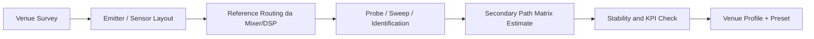

# 00. Teoria completa del sistema ANC indoor per bass spill control

## Scopo del documento

Questo file e il riferimento teorico piu denso della cartella `research/`. Non sostituisce i capitoli specialistici `01-05`, ma li integra con una vista unica e continua.

L'obiettivo non e descrivere un ANC generico. L'obiettivo e formalizzare la teoria di un **sistema commerciale indoor MIMO** per la **riduzione del bass spill** verso vicinato e boundary sensibili.

## 1. Definizione corretta del problema

Il prodotto non cerca di annullare il campo sonoro ovunque. Cerca di:

- ridurre l'energia che lascia la venue nelle bande basse critiche;
- preservare la qualita sonora interna entro limiti operativi accettabili;
- operare su piu punti di misura interni ed esterni;
- usare un riferimento anticipato acquisito dal sistema audio.

Questo porta a una formulazione diversa da quella di un ANC didattico puntuale.

### Problema naive

Ridurre la pressione in un solo punto:

```math
e(n)=d(n)-y'(n)
```

### Problema prodotto

Ridurre un vettore di errori su piu sensori:

```math
\mathbf{e}(n)=\mathbf{d}(n)-\mathbf{S}(z)\mathbf{y}(n)
```

dove:

- `\mathbf{d}(n)` e il campo indesiderato misurato sui sensori;
- `\mathbf{y}(n)` e il vettore dei segnali inviati agli emitter ANC;
- `\mathbf{S}(z)` e la matrice dei `secondary path`.

## 2. Perche la bassa frequenza e il target naturale

La lunghezza d'onda vale:

```math
\lambda = \frac{c}{f}
```

con `c \approx 343 m/s`.

| Banda | Ordine di grandezza della lunghezza d'onda | Implicazione |
|---|---|---|
| `31.5 Hz` | `~10.9 m` | forte interazione con modi della stanza e strutture |
| `63 Hz` | `~5.4 m` | tipica banda critica per spill di subwoofer |
| `125 Hz` | `~2.7 m` | ancora controllabile, ma piu sensibile spazialmente |

L'interesse commerciale per la bassa frequenza nasce da tre fatti:

1. e la regione piu difficile da contenere con sola passivita;
2. e la regione che attraversa piu facilmente strutture e confini;
3. e la regione in cui un sistema attivo ha ancora una ragionevole leva spaziale.

## 3. Principio fisico di base

In regime lineare vale il principio di sovrapposizione:

```math
p_{tot}(\mathbf{r},t)=p_p(\mathbf{r},t)+p_s(\mathbf{r},t)
```

Il sistema attivo cerca di generare un contributo `p_s` tale da ridurre l'energia del contributo primario `p_p` su un insieme di punti selezionati.

La forma energetica locale e:

```math
J = \mathbb{E}[e^2(n)]
```

oppure, nel caso multi-sensore:

```math
J = \mathbb{E}[\mathbf{e}^T(n)\mathbf{W}_e\mathbf{e}(n)]
```

dove `\mathbf{W}_e` pesa in modo diverso sensori interni, sensori di confine e punti critici.

## 4. Causalita e valore del riferimento da mixer/DSP

La causalita e il vincolo piu duro del controllo `feed-forward`.

Se una perturbazione percorre una distanza `r`, il tempo di volo e:

```math
\tau = \frac{r}{c}
```

A `48 kHz`, `1 m` equivale a circa:

```math
D \approx \frac{1}{343}\cdot 48000 \approx 140 \text{ campioni}
```

Se il controllore riceve il contenuto musicale direttamente da `mixer`, `DSP` o uscita `sub`, il sistema vede il segnale **prima** che esso ecciti modi e boundary della venue. Questo:

- riduce il carico della causalita;
- migliora la predicibilita del controllo;
- rende il sistema realmente `feed-forward`.

Un sistema solo microfonico ha invece un margine temporale molto piu povero e tende a comportarsi come un feedback fragile.

## 5. Indoor come beachhead corretto

L'indoor e il punto di partenza giusto non solo commercialmente, ma anche teoricamente:

- geometria piu stabile;
- percorsi acustici piu ripetibili;
- eccitazione musicale piu controllabile;
- maggiore possibilita di mappare modi dominanti e leakage path.

La controparte di questa stabilita e che il campo non e libero: esistono modi, riflessioni, aperture e superfici radianti che trasformano il problema in una questione di **controllo modale e di leakage**.

## 6. Acustica modale indoor

In prima approssimazione una stanza rettangolare ha modi con frequenze:

```math
f_{mnp} = \frac{c}{2}\sqrt{
\left(\frac{m}{L_x}\right)^2+
\left(\frac{n}{L_y}\right)^2+
\left(\frac{p}{L_z}\right)^2}
```

dove:

- `L_x, L_y, L_z` sono le dimensioni della stanza;
- `m,n,p` sono interi non negativi.

Questa formula non basta per descrivere una venue reale, ma chiarisce perche:

- certe bande basse vengono amplificate in modo persistente;
- alcuni punti della stanza sono molto piu critici di altri;
- il controllo deve essere distribuito nello spazio.

## 7. Da quiet zone locale a spill control distribuito

Un controllore `SISO` classico crea una regione di riduzione locale intorno al microfono di errore. Un prodotto per venue deve invece ottimizzare un compromesso:

- riduzione nei punti esterni;
- non degradazione dei punti interni;
- robustezza ai mismatch tra modello e ambiente.

Una formulazione pesata e:

```math
J = \mathbb{E}[
\mathbf{e}_b^T(n)\mathbf{W}_b\mathbf{e}_b(n)
]
+
\alpha
\mathbb{E}[
\mathbf{e}_i^T(n)\mathbf{W}_i\mathbf{e}_i(n)
]
```

dove:

- `\mathbf{e}_b` rappresenta gli errori ai boundary;
- `\mathbf{e}_i` rappresenta le deviazioni nei punti interni;
- `\alpha` regola il compromesso tra spill reduction e preservazione interna.

## 8. Secondary path: da SISO a matrice MIMO

Nel caso prodotto ogni emitter influenza ogni sensore:

```math
\mathbf{S}(z)=
\begin{bmatrix}
S_{11}(z) & \cdots & S_{1M}(z) \\
\vdots & \ddots & \vdots \\
S_{N1}(z) & \cdots & S_{NM}(z)
\end{bmatrix}
```

L'identificazione non e quindi un singolo problema FIR, ma un insieme accoppiato di identificazioni.

### Implicazioni pratiche

- aumenta la complessita della calibrazione;
- aumenta il rischio di `cross-coupling`;
- rende indispensabile un software di commissioning;
- richiede sincronizzazione rigorosa dei canali.

## 9. Perche l'LMS semplice non basta

Nel problema ANC l'uscita digitale non si somma direttamente con il primario. Attraversa il `secondary path`.

Nel caso `SISO`:

```math
e(n)=d(n)-s(n)*y(n)
```

Se si applicasse LMS direttamente con `x(n)`, il gradiente sarebbe calcolato sul regressore sbagliato.

Da qui nasce il `Filtered-x LMS`, che usa:

```math
x_f(n)=\hat{s}(n)*x(n)
```

e aggiorna:

```math
\mathbf{w}(n+1)=\mathbf{w}(n)+\mu e(n)\mathbf{x}_f(n)
```

## 10. Derivazione concettuale del FxLMS

Definiamo la funzione di costo:

```math
J(n)=e^2(n)
```

La discesa del gradiente richiede:

```math
\mathbf{w}(n+1)=\mathbf{w}(n)-\frac{\mu}{2}\nabla J(n)
```

Poiche:

```math
e(n)=d(n)-s(n)*(\mathbf{w}^T(n)\mathbf{x}(n))
```

la derivata esatta e scomoda perche il `secondary path` mescola tempi diversi. Sotto l'ipotesi di `slow adaptation`, i pesi cambiano lentamente rispetto alla memoria del plant e si ottiene l'approssimazione pratica:

```math
\frac{\partial e(n)}{\partial \mathbf{w}(n)} \approx -\mathbf{x}_f(n)
```

da cui:

```math
\mathbf{w}(n+1)=\mathbf{w}(n)+\mu e(n)\mathbf{x}_f(n)
```

## 11. Normalizzazione, leakage e robustezza

Per contenere la dipendenza dall'energia del regressore si usa spesso:

```math
\mathbf{w}(n+1)=
\mathbf{w}(n)+
\frac{\mu}{\|\mathbf{x}_f(n)\|^2+\varepsilon}
e(n)\mathbf{x}_f(n)
```

Nel repository attuale la norma viene approssimata con una stima IIR di potenza:

```math
P(n)=\beta P(n-1)+(1-\beta)x_f^2(n)
```

e:

```math
\mu_n=\frac{\mu}{P(n)+\varepsilon}
```

Il termine di `leakage` porta a:

```math
\mathbf{w}(n+1)=\lambda \mathbf{w}(n)+\mu_n e(n)\mathbf{x}_f(n)
```

con `0<\lambda\le 1`.

### Perche il leakage aiuta

- limita il `weight drift`;
- smorza errori di modellazione;
- migliora il comportamento in condizioni non stazionarie.

### Costo del leakage

- introduce bias;
- riduce aggressivita rispetto all'ottimo ideale;
- puo limitare la massima attenuazione raggiungibile.

## 12. Generalizzazione MIMO

Nel caso `MIMO`, ogni uscita dipende da un vettore di filtri e il costo diventa multi-sensore. Una forma concettuale del gradiente e:

```math
\mathbf{W}(n+1)=\mathbf{W}(n)+\mu \sum_{k=1}^{N}
e_k(n)\mathbf{x}_{f,k}(n)
```

dove `\mathbf{x}_{f,k}(n)` rappresenta il riferimento filtrato attraverso i path che collegano gli emitter al sensore `k`.

In pratica:

- cresce il costo computazionale;
- cresce il rischio di instabilita locale;
- diventano necessari vincoli e pesi per i diversi sensori.

## 13. Perche il prodotto non puo fermarsi al FxLMS puro

Il piano di prodotto prevede quattro livelli:

1. modellazione iniziale della venue;
2. controllo modale indoor;
3. adattamento `MIMO Filtered-x`;
4. supervisione robusta.

Il `FxLMS` copre soprattutto il terzo livello. Non copre da solo:

- la definizione dei leakage path dominanti;
- la selezione dei nodi attivi migliori;
- i limiti di saturazione;
- il fallback safe mode;
- la reportistica di commissioning.

## 14. Errori di fase e margine di stabilita

Il `Filtered-x` dipende fortemente dalla coerenza di fase tra `S(z)` e `\hat{S}(z)`.

Una regola ingegneristica utile:

- errore di fase piccolo: il gradiente resta utile;
- errore vicino a `90 deg`: il gradiente perde molta efficacia;
- errore oltre `90 deg`: l'aggiornamento puo diventare controproducente.

Per questo la qualita della calibrazione vale piu della semplice "potenza dell'algoritmo".

## 15. Spill control come problema a vincoli

Il sistema non deve minimizzare solo l'errore esterno. Deve anche rispettare vincoli sul campo interno:

```math
\|\Delta \mathbf{p}_{int}\| \le \delta
```

dove `\delta` rappresenta la tolleranza di degrado interna accettabile.

Nel piano attuale il riferimento operativo e:

- riduzione media esterna `4-8 dB` in banda bassa critica;
- degrado interno circa entro `+-2 dB`.

Questi numeri sono importanti perche trasformano la teoria in accettazione prodotto.

## 16. Commissioning come parte della teoria applicata

Un sistema commerciale serio ha bisogno di una procedura ripetibile:



Questo non e un aspetto "di prodotto" separato dalla teoria. E la traduzione operativa delle ipotesi matematiche che rendono valido il controllore.

## 17. KPI come chiusura del cerchio fisico

I KPI corretti sono quelli che chiudono davvero il legame tra acustica, controllo e business:

- riduzione media al boundary esterno;
- riduzione minima nel punto peggiore;
- deviazione interna nei listening point;
- stabilita durante materiale musicale reale;
- tempo di commissioning e retuning.

Una metrica base resta:

```math
\Delta L = 10\log_{10}\frac{\mathbb{E}[d^2(n)]}{\mathbb{E}[e^2(n)]}
```

ma va sempre associata a:

- punto di misura;
- banda di frequenza;
- scenario `ANC off/on`;
- contenuto musicale utilizzato.

## 18. Limiti fisici non negoziabili

Il sistema non potra mai essere venduto credibilmente come:

- cancellazione universale su tutto lo spettro;
- sostituto totale dell'isolamento passivo;
- soluzione senza commissioning;
- controller infallibile in ogni venue.

La verita fisica e piu precisa:

- il prodotto ha senso in bassa frequenza;
- il prodotto ha senso in ambienti indoor calibrabili;
- il prodotto ha senso se misura e controlla lo spill su piu punti;
- il prodotto fallisce se non tiene sotto controllo il degrado interno.

## 19. Relazione con il repository attuale

Il repository corrente e utile perche contiene gia:

- una baseline `FxLMS` leggibile;
- una baseline di identificazione `SISO`;
- un simulatore di propagazione e sorgenti non banali;
- una visualizzazione dei risultati.

Ma non contiene ancora:

- `MIMO FxLMS` reale;
- room model venue-oriented;
- leakage model esplicito;
- commissioning multi-canale;
- performance monitor di prodotto.

## 20. Sintesi finale

La teoria completa del progetto porta a una conclusione netta:

1. il problema giusto e `bass spill control`, non silenzio totale;
2. il beachhead giusto e `indoor permanente`;
3. il riferimento giusto e `feed-forward` da `mixer/DSP`;
4. la topologia giusta e `MIMO`;
5. il cervello giusto e un `Edge DSP Controller`;
6. la vendibilita dipende da KPI misurati su boundary e listening points.

Questo e il quadro matematico e fisico che deve guidare qualunque riscrittura del repository e della documentazione.
