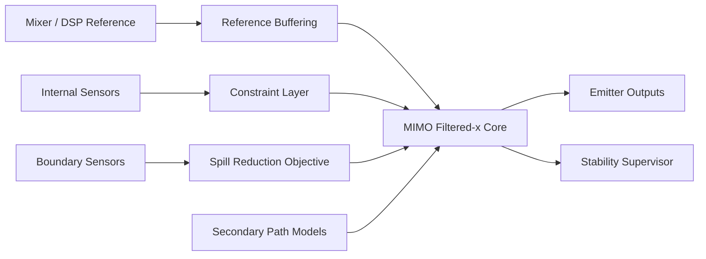

# 03. Il controllore FxLMS nella roadmap prodotto

## Punto chiave

`FxLMS` e il baseline corretto del repository, ma il prodotto target non e "il file `FxLMSFilter.m` messo in produzione". Il prodotto target e un **controllore MIMO eseguito su `Edge DSP Controller`**, alimentato da riferimento `feed-forward` da `mixer/DSP` e supervisionato da sensori interni e di confine.

## 1. Perche l'LMS semplice non basta

Nel controllo attivo reale il segnale digitale non arriva direttamente al punto di misura. Attraversa il `secondary path`:

```math
e(n)=d(n)-s(n)*y(n)
```

Se il controllore aggiornasse i pesi con il riferimento grezzo `x(n)`, il gradiente sarebbe disallineato in tempo e fase. Per questo si usa il riferimento filtrato:

```math
x_f(n)=\hat{s}(n)*x(n)
```

e la forma operativa di base:

```math
\mathbf{w}(n+1)=\mathbf{w}(n)+\mu e(n)\mathbf{x}_f(n)
```

## 2. Derivazione concettuale del gradiente

La funzione di costo istantanea nel caso base e:

```math
J(n)=e^2(n)
```

La discesa del gradiente impone:

```math
\mathbf{w}(n+1)=\mathbf{w}(n)-\frac{\mu}{2}\nabla J(n)
```

Poiche il `secondary path` agisce tra uscita del controllore e sensore, la derivata esatta rispetto a `\mathbf{w}(n)` e scomoda. Sotto l'ipotesi di `slow adaptation`, il gradiente utile viene approssimato tramite il regressore filtrato `\mathbf{x}_f(n)`.

Questo e il cuore del passaggio da LMS a `FxLMS`: non cambia l'idea della minimizzazione, cambia il regressore con cui il sistema vede l'errore.

## 3. Dove si colloca il riferimento da mixer/DSP

Nel progetto canonico:

- `x(n)` non nasce da un microfono ambientale generico;
- `x(n)` e il contenuto musicale acquisito a monte, da `mixer`, `DSP` o `sub out`;
- l'errore viene misurato a valle, tramite array di sensori interni e di confine.

Questo sposta il sistema da una logica reattiva a una logica davvero `feed-forward`.

## 4. Architettura target del controllore



## 5. Cosa fa oggi il repository

Il file `FxLMSFilter.m` implementa una versione `SISO` con:

- regressore `filtered-x`;
- normalizzazione tramite stima IIR di potenza;
- termine di `leakage`;
- aggiornamento sample-by-sample.

La logica implementata e:

```math
P(n)=\beta P(n-1)+(1-\beta)x_f^2(n)
```

```math
\mu_n=\frac{\mu}{P(n)+\varepsilon}
```

```math
\mathbf{w}(n+1)=\lambda \mathbf{w}(n)+\mu_n e(n)\mathbf{x}_f(n)
```

Questa e una buona baseline, ma va letta come **mattoncino** del controllore prodotto, non come architettura finale.

## 6. Perche la normalizzazione serve davvero

Senza normalizzazione, l'aggressivita dell'aggiornamento dipende troppo dall'energia del segnale. In un contesto musicale:

- kick e sub possono produrre picchi di energia molto diversi nel tempo;
- il riferimento non e stazionario;
- un singolo `mu` fisso diventa fragile.

La normalizzazione via `P(n)` nel repository riduce questo problema a costo computazionale basso.

## 7. Perche il leakage e piu di un trucco numerico

Il termine di `leakage`:

- limita la deriva dei pesi in presenza di mismatch;
- rende piu sopportabili cambiamenti lenti del plant;
- riduce il rischio di accumulare energia in una soluzione sbagliata.

Il prezzo e un bias rispetto al filtro ottimo ideale. In un prodotto reale questo trade-off e spesso accettabile, perche la stabilita e piu importante dell'ottimalita teorica locale.

## 8. Errore di fase e perdita del gradiente utile

Se la fase del modello `\hat{S}(z)` si discosta troppo da quella reale:

- il gradiente viene ruotato;
- l'aggiornamento corregge nella direzione sbagliata;
- il sistema puo smettere di migliorare o addirittura peggiorare il residuo.

Questa e la ragione tecnica per cui il controller non puo essere separato dalla qualita della calibrazione.

## 9. Passaggio dal costo locale al costo multi-sensore

Nel prodotto, il costo non e piu:

```math
J(n)=e^2(n)
```

ma qualcosa di piu vicino a:

```math
J(n)=\mathbf{e}^T(n)\mathbf{W}_e\mathbf{e}(n)
```

oppure a una combinazione di costo esterno e vincoli interni:

```math
J(n)=
\mathbf{e}_b^T(n)\mathbf{W}_b\mathbf{e}_b(n)
+
\alpha \mathbf{e}_i^T(n)\mathbf{W}_i\mathbf{e}_i(n)
```

Questo e un cambio fondamentale: il controller prodotto non ottimizza un solo microfono, ma un compromesso spaziale.

## 10. MIMO FxLMS: forma concettuale

Nel caso `MIMO`, ogni sensore riceve il contributo di tutti gli emitter e ogni emitter usa un insieme di pesi. Una forma concettuale del gradiente e:

```math
\mathbf{W}(n+1)=\mathbf{W}(n)+\mu
\sum_{k=1}^{N} e_k(n)\mathbf{X}_{f,k}(n)
```

dove `\mathbf{X}_{f,k}(n)` contiene il riferimento filtrato attraverso i path che collegano gli emitter al sensore `k`.

Questo porta con se:

- aumento del costo computazionale;
- aumento del cross-coupling;
- necessita di vincoli e priorita tra sensori.

## 11. Cosa manca per il prodotto

| Area | Baseline attuale | Richiesta prodotto |
|---|---|---|
| topologia | `SISO` | `MIMO` |
| obiettivo | errore singolo | riduzione spill + vincoli interni |
| sensori | singolo errore | array interni + boundary mic |
| controllo | adattamento locale | multi-layer con supervisione robusta |
| deployment | classe MATLAB | runtime real-time su `Edge DSP Controller` |

## 12. Strati di controllo coerenti con il piano

### Layer 1 - Modellazione iniziale

- stima dei `secondary path` multi-canale;
- mappa delle vie di leakage dominanti;
- definizione del profilo venue.

### Layer 2 - Controllo modale indoor

- riduzione dei modi interni che alimentano lo spill;
- priorita sulle bande `31.5-125 Hz`.

### Layer 3 - Adattamento MIMO

- `MIMO FxLMS` come base;
- combinazione `feed-forward` + feedback moderato;
- compensazione di drift operativi.

### Layer 4 - Supervisione

- limiti di guadagno;
- anti-instabilita;
- safe mode;
- disattivazione selettiva di nodi problematici.

## 13. Lettura corretta dei parametri

| Parametro | Significato operativo |
|---|---|
| `mu` | velocita di adattamento; troppo alto degrada stabilita |
| `epsilon` | protezione numerica a bassa energia |
| `leakage` | robustezza contro drift e mismatch |
| `beta` | memoria della stima di potenza |

## 14. Complessita computazionale

Nel caso `SISO`, il costo resta lineare nella lunghezza del filtro. Nel passaggio a `MIMO` il costo cresce rapidamente con:

- numero di emitter;
- numero di sensori;
- lunghezza dei filtri di controllo;
- lunghezza dei `secondary path`.

Per questo il piano insiste su un `Edge DSP Controller` dedicato: il controller prodotto non puo essere valutato solo sulla bonta matematica, ma anche sulla fattibilita runtime.

## 15. Failure modes da tenere in vista

- `secondary path` obsoleto o stimato male;
- saturazione degli attuatori;
- conflitto tra riduzione esterna e preservazione interna;
- peso eccessivo di sensori rumorosi o mal posizionati;
- burst dovuti a instabilita locale.

Un prodotto serio deve riconoscere questi failure mode e non solo massimizzare l'attenuazione.

## 16. Nota importante sul repository

Nel codice corrente esiste un disallineamento documentale tra la firma attuale di `FxLMSFilter.m` e un blocco placeholder in `OfflineSystemID.m`. La documentazione canonica deve seguire la firma reale del costruttore, non il placeholder legacy.

## Sintesi

`FxLMS` resta la base giusta da cui partire. La visione commerciale, pero, richiede il passaggio da un controllore `SISO` da laboratorio a un **controllore MIMO indoor edge-executed** per il `bass spill control`.
